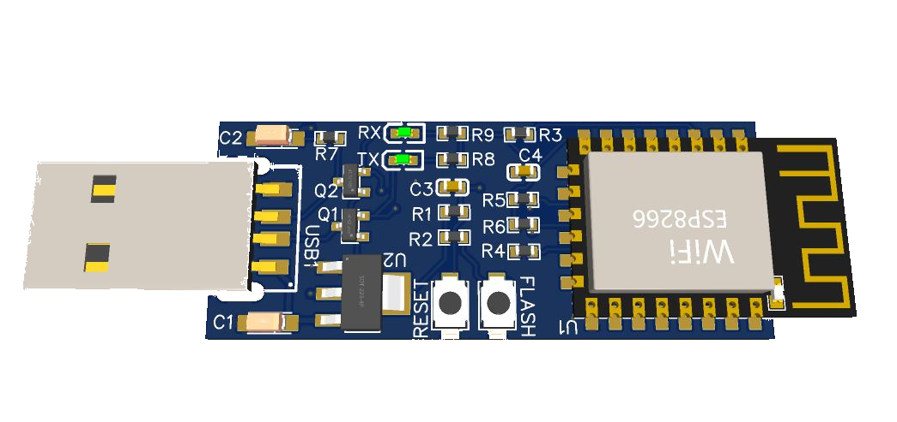

# Midea mini dongle

An open project for a stick for air conditioners controlled by the Midea UART protocol. This repository contains a schematic and PCB layout for a Midea mini dongle. Also there is a folder for fabrication of the dongles by [jlcpcb](https://jlcpcb.com/)

A far from complete list of supported brands:
1. [Midea](https://www.midea.com/)
2. [Electrolux](https://www.electrolux.ru/)
3. [Qlima](https://www.qlima.com/)
4. [Artel](https://www.artelgroup.com/)
5. [Carrier](https://www.carrier.com/)
6. [Comfee](http://www.comfee-russia.ru/)
7. [Inventor](https://www.inventorairconditioner.com/)
8. [Dimstal](https://www.dimstal.de/)

### Credits

Thanks to [Sergey V. Dudanov](https://github.com/dudanov) who created an excelent [midea_ac](https://esphome.io/components/climate/midea_ac.html) component for ESPHome that integrates midea-like aircondititioners with Home Assistant.

## Schematic

This is the schematic of Midea mini dongle

All the files needed to open the design in EasyEDA are also included.

## PCB 
Dimensions: 
 - Width x Height: 49x20mm
 - USB connector: +15mm 
 - Overall: 71x20mm
 - Thickness: 1.6mm

### 2D View

The last 3 files can be used to order a stick from the [JLCPCB](https://jlcpcb.com) factory. All that remains is to solder the radio module and the USB connector yourself.

## Fabrication
The 3 files in the fabricarion folder is all you need to order the sticks from JLCPCB. I do not have tried other fabs.

## Frequently asked Questions:
> How can I tell if my air conditioner is supported or not?

*None 100% answer to the question. But there is a high probability of support if your air conditioner has a USB connector, a regular place for a stick, UART is used.*

> What firmware would you recommend?

*Initially, the stick was developed for [ESPHome](https://esphome.io) and [Home Assistant](https://www.home-assistant.io), but it is possible to write your own firmware for your tasks and needs if you have the appropriate skills.*

> Is it possible to purchase a ready-made stick?

*Yes, you can write me to my at [e-mail](mailto:johnnyvandeberg@gmail.com).*

